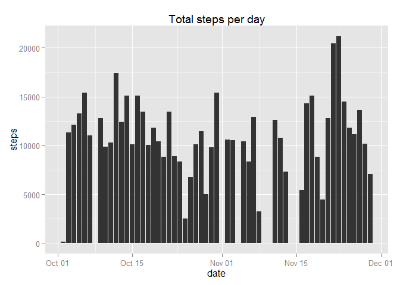
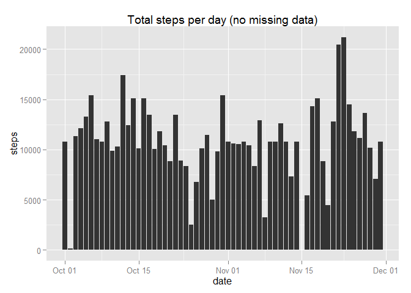

# Reproducible Research: Course Project 1 - Peer Assessment 1
Andrii Krasnyi  
17 October 2015  


## Loading and preprocessing the data
Set path to the folder clonned from github and unzip data. 


```r
##pathref <- file.path("../Deloitte Analytics/Training/Coursera/Reproducible ##Research/RepData_PeerAssessment1/")
##   setwd(pathref)
   unzip("activity.zip")
```

## Read test data
read data into R   

```r
   data_a <- read.csv("activity.csv", header = TRUE,  colClasses = c("integer", "Date", "character"))
   str(data_a)
```

```
## 'data.frame':	17568 obs. of  3 variables:
##  $ steps   : int  NA NA NA NA NA NA NA NA NA NA ...
##  $ date    : Date, format: "2012-10-01" "2012-10-01" ...
##  $ interval: chr  "0" "5" "10" "15" ...
```

```r
   summary(data_a)
```

```
##      steps             date              interval        
##  Min.   :  0.00   Min.   :2012-10-01   Length:17568      
##  1st Qu.:  0.00   1st Qu.:2012-10-16   Class :character  
##  Median :  0.00   Median :2012-10-31   Mode  :character  
##  Mean   : 37.38   Mean   :2012-10-31                     
##  3rd Qu.: 12.00   3rd Qu.:2012-11-15                     
##  Max.   :806.00   Max.   :2012-11-30                     
##  NA's   :2304
```
#re-format date
this migt be an extra step to format data in british format 


```r
data_a$date <- as.Date(data_a$date, format="%d/%m/%Y")
```

Remove N/A from dataset 

```{r} echo=true
data_noNA <- na.omit(data_a)
```


## What is mean total number of steps taken per day?
Following  plot will demonstrate summary of total steps per day


```r
library(dplyr)
```

```
## Warning: package 'dplyr' was built under R version 3.2.1
```

```
## 
## Attaching package: 'dplyr'
## 
## The following objects are masked from 'package:stats':
## 
##     filter, lag
## 
## The following objects are masked from 'package:base':
## 
##     intersect, setdiff, setequal, union
```

```r
library(ggplot2) 
```

```
## Warning: package 'ggplot2' was built under R version 3.2.2
```

```r
data_agr <- aggregate(steps~date, data_a,sum)
plot_d <- ggplot(data_agr, aes(x=date, y=steps)) + 
    geom_histogram (stat='identity', binwidth = 0.01) +
    ggtitle("Total steps per day") 
##    theme_bw ()
print(plot_d)
```

 
Following code will calculate meam and mediam steps per day


```r
mean_steps <- mean(data_agr$steps, na.rm=TRUE)
median_steps <- median(data_agr$steps, na.rm=TRUE)

print(mean_steps)
```

```
## [1] 10766.19
```

```r
print(median_steps)
```

```
## [1] 10765
```

## What is the average daily activity pattern?

```r
data_agr1 <- aggregate(x=list(avg_steps=data_a$steps), by=list(interval=data_a$interval), FUN=mean, na.rm=TRUE)
data_agr1$interval <- as.numeric(as.character(data_agr1$interval))
```

Creating a time series plot (i.e. type = "l") of the 5-minute interval (x-axis) and the average number of steps taken, averaged across all days (y-axis)


```r
plot_d1<- ggplot(data=data_agr1, aes(interval, avg_steps, group = 2)) +
    geom_point()+
    geom_line() +
##    geom_histogram (stat='identity', binwidth = 0.01)+
    xlab("5-minute interval") +
    ylab("average number of steps taken")
##    ggtitle("Time Series of activity per day")
    ##    theme_bw ()
print(plot_d1)
```

 
Answerinfg question - Which 5-minute interval, on average across all the days in the dataset, contains the maximum number of steps?


```r
library(dplyr)
max_interval<- filter(data_agr1, avg_steps==max(avg_steps))
max_interval
```

```
##   interval avg_steps
## 1      835  206.1698
```

## Imputing missing values
There are a number of days/intervals where there are missing values (coded as NA). The presence of missing days may introduce bias into some calculations or summaries of the data.

Total number of missing values in the dataset (i.e. the total number of rows with NAs)


```r
na_val <- sum(is.na(data_a))
na_val
```

```
## [1] 2304
```

2.My strategy for filling in all of the missing values in the dataset use the mean for that 5-minute interval, etc.

3.Create a new dataset that is equal to the original dataset but with the missing data filled in.


```r
data_full <- data_a 
for (i in 1:nrow(data_full)) {
    if (is.na(data_full$steps[i])) {
        data_full$steps[i] <- data_agr1[which(data_full$interval[i] == data_agr1$interval),]$avg_steps
    }
}

head(data_full)
```

```
##       steps       date interval
## 1 1.7169811 2012-10-01        0
## 2 0.3396226 2012-10-01        5
## 3 0.1320755 2012-10-01       10
## 4 0.1509434 2012-10-01       15
## 5 0.0754717 2012-10-01       20
## 6 2.0943396 2012-10-01       25
```

```r
sum(is.na(data_full))
```

```
## [1] 0
```

4.Histogram of the total number of steps taken each day and Calculate and report the mean and median total number of steps taken per day. Do these values differ from the estimates from the first part of the assignment? What is the impact of imputing missing data on the estimates of the total daily number of steps?


```r
library(ggplot2) 

data_agr2 <- aggregate(steps~date, data_full,sum)
plot_d2 <- ggplot(data_agr2, aes(x=date, y=steps)) + 
    geom_histogram (stat='identity', binwidth = 0.01) +
    ggtitle("Total steps per day (no missing data)") 
##    theme_bw ()
print(plot_d2)
```

 
Following code will calculate meam and mediam steps per day


```r
mean_steps_f <- mean(data_agr2$steps, na.rm=TRUE)
mean_steps_f
```

```
## [1] 10766.19
```

```r
median_steps_f <- median(data_agr2$steps, na.rm=TRUE)
median_steps_f
```

```
## [1] 10766.19
```
For new dataset median = mean

## Are there differences in activity patterns between weekdays and weekends?

In this part we investigate differences in activity patterns between weekdays and weekends

For this part the weekdays() function may be of some help here. Use the dataset with the filled-in missing values for this part.

1.Create a new factor variable in the dataset with two levels - "weekday" and "weekend" indicating whether a given date is a weekday or weekend day.


```r
data_full <- mutate(data_full, weekday=weekdays(date)) 
data_full$day <- ifelse(as.POSIXlt(data_full$date)$wday %in% c(0,6), 'weekend', 'weekday')
```

2.Make a panel plot containing a time series plot (i.e. type = "l") of the 5-minute interval (x-axis) and the average number of steps taken, averaged across all weekday days or weekend days (y-axis). 


```r
data_agr3 <- aggregate(steps ~ interval + day, data=data_full, mean)
data_agr3$interval <- as.numeric(as.character(data_agr3$interval))
plot_d4 <- ggplot(data_agr3, aes(interval, steps, group=2)) + 
    geom_line() + 
    facet_grid(day ~ .) +
    xlab("5-minute interval") + 
    ylab("avarage number of steps")
print(plot_d4)
```

 


